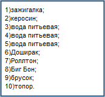

# snowdesert
<!doctype html>
<html>
<head>
<meta charset="utf-8">
<title>Snow desert</title>
<meta name="generator" content="WYSIWYG Web Builder 14 Trial Version - http://www.wysiwygwebbuilder.com">
<link href="base/jquery-ui.min.css" rel="stylesheet">
<link href="Егор_1.css" rel="stylesheet">
<link href="index.css" rel="stylesheet">

</head>
<body>

<input type="submit" id="Button1" onclick="ShowObject('wb_Shape1', 1);ShowObject('Button3', 1);ShowObject('wb_Text1', 0);ShowObject('Button1', 0);ShowObject('wb_Picture1', 1);ShowObject('wb_Text3', 0);ShowObject('wb_Image1', 1);ShowObject('Button4', 1);ShowObject('wb_Image4', 1);ShowObject('Progressbar1', 1);ShowObject('Progressbar2', 1);ShowObject('wb_IconFont1', 1);ShowObject('wb_IconFont2', 1);return false;" name="" value="Начать игру!" style="position:absolute;left:502px;top:87px;width:370px;height:26px;z-index:35;">

   
   

      
Title

      
Image description goes here

      <a class="link" href="">More information</a>
   

<strong>SNOW DESERT</strong>

<input type="submit" id="Button3" onclick="ShowObject('wb_Shape1', 0);ShowObject('Button3', 0);ShowObject('wb_Picture1', 0);ShowObject('wb_Picture3', 1);ShowObject('wb_Shape2', 1);ShowObject('Button6', 1);ShowObject('Button7', 1);return false;" name="" value="Далее..." style="position:absolute;left:874px;top:608px;width:96px;height:25px;visibility:hidden;z-index:40;">
<picture id="wb_Picture1" style="position:absolute;left:428px;top:124px;width:543px;height:360px;visibility:hidden;z-index:41">

</picture>

Вы оказались посреди тундры и ваша главная&nbsp; задача - выжить!

<table style="position:absolute;left:160px;top:10px;width:256px;height:283px;z-index:44;visibility:hidden;" id="Table1">
<tr>
<td class="cell0"><picture id="wb_Picture2" style="display:none;width: 100%;height:45px;z-index:0">

</picture>
</td>
<td class="cell0">

</td>
<td class="cell0">

</td>
<td class="cell0">

</td>
<td class="cell0">

</td>
</tr>
<tr>
<td class="cell0"><picture id="wb_Picture5" style="display:none;width: 100%;height:47px;z-index:5">

</picture>
</td>
<td class="cell0"><picture id="wb_Picture6" style="display:none;width: 100%;height:47px;z-index:6">

</picture>
</td>
<td class="cell0"><picture id="wb_Picture7" style="display:none;width: 100%;height:47px;z-index:7">

</picture>
</td>
<td class="cell0"><picture id="wb_Picture8" style="display:none;width: 100%;height:43px;z-index:8">

</picture>
</td>
<td class="cell0"><picture id="wb_Picture9" style="display:none;width: 100%;height:44px;z-index:9">

</picture>
</td>
</tr>
<tr>
<td class="cell0"><picture id="wb_Picture10" style="display:none;width: 100%;height:49px;z-index:10">

</picture>
</td>
<td class="cell1"> </td>
<td class="cell1"> </td>
<td class="cell2"> </td>
<td class="cell2"> </td>
</tr>
<tr>
<td colspan="4" class="cell3"><picture id="wb_Picture12" style="display:none;width: 100%;height:113px;z-index:11">

</picture>
</td>
<td class="cell4">

</td>
</tr>
</table>
<input type="submit" id="Button4" onclick="ShowObject('Table1', 1);ShowObject('Button4', 0);ShowObject('Button5', 1);ShowObjectWithEffect('wb_Image2', 1, '', 0);ShowObjectWithEffect('wb_Image3', 1, '', 0);ShowObjectWithEffect('wb_Picture2', 1, '', 0);ShowObjectWithEffect('wb_Picture12', 1, '', 0);return false;" name="" value="Открыть" style="position:absolute;left:427px;top:96px;width:96px;height:25px;visibility:hidden;z-index:45;">
<input type="submit" id="Button5" onclick="ShowObject('Table1', 0);ShowObject('Button5', 0);ShowObject('Button4', 1);ShowObjectWithEffect('wb_Image2', 0, '', 0);ShowObjectWithEffect('wb_Image3', 0, '', 0);ShowObjectWithEffect('wb_Picture2', 0, '', 0);ShowObjectWithEffect('wb_Image6', 0, '', 0);ShowObjectWithEffect('wb_Image7', 0, '', 0);ShowObjectWithEffect('wb_Image8', 0, '', 0);ShowObjectWithEffect('wb_Picture12', 0, '', 0);return false;" name="" value="Закрыть" style="position:absolute;left:427px;top:96px;width:96px;height:25px;visibility:hidden;z-index:46;">
<picture id="wb_Picture3" style="position:absolute;left:428px;top:124px;width:543px;height:361px;visibility:hidden;z-index:47">

</picture>

<form name="SNOW_DESERT" method="post" action="mailto:egorkuku@inbox.ru" enctype="text/plain" id="Form1">
<label for="TextArea1" id="Label1" style="visibility:hidden;position:absolute;left:10px;top:0px;width:182px;height:16px;line-height:16px;z-index:26;">Оставьте мне свой отзыв!</label>
<input type="submit" id="Button2" name="" value="ОТПРАВИТЬ" style="position:absolute;left:114px;top:135px;width:96px;height:25px;visibility:hidden;z-index:27;">
<textarea name="Your feedback" id="TextArea1" style="position:absolute;left:10px;top:24px;width:190px;height:90px;visibility:hidden;z-index:28;" rows="4" cols="29" spellcheck="false"></textarea>
</form>

<input type="submit" id="Button6" onclick="ShowObject('wb_Text4', 1);ShowObject('wb_Picture4', 1);ShowObject('wb_Picture3', 0);ShowObject('wb_Shape2', 0);ShowObject('wb_Shape3', 1);ShowObject('Button6', 0);ShowObject('Button7', 0);return false;" name="" value="Атака" style="position:absolute;left:874px;top:608px;width:97px;height:25px;visibility:hidden;z-index:51;">
<input type="submit" id="Button7" onclick="ShowObject('wb_Image5', 1);ShowObject('wb_Shape4', 1);ShowObject('Button7', 0);ShowObject('Button8', 1);return false;" name="" value="Уйти" style="position:absolute;left:428px;top:608px;width:96px;height:25px;visibility:hidden;z-index:52;">
<picture id="wb_Picture4" style="position:absolute;left:428px;top:124px;width:543px;height:360px;visibility:hidden;z-index:53">

</picture>

GAME OVER!

<input type="submit" id="Button8" onclick="ShowObject('Button9', 1);ShowObject('Button4', 0);ShowObject('Dialog', 1);ShowObject('wb_Shape5', 1);ShowObject('wb_Shape6', 1);ShowObject('Button10', 1);ShowObject('wb_Image9', 1);ShowObject('wb_Shape7', 1);ShowObject('Button12', 1);ShowObject('Button8', 0);return false;" name="" value="Далее..." style="position:absolute;left:873px;top:608px;width:97px;height:25px;visibility:hidden;z-index:58;">
<input type="submit" id="Button9" onclick="ShowObject('Table1', 1);ShowObjectWithEffect('wb_Image2', 1, '', 0);ShowObjectWithEffect('wb_Image3', 1, '', 0);ShowObjectWithEffect('wb_Picture2', 1, '', 0);ShowObjectWithEffect('wb_Image7', 1, '', 0);ShowObjectWithEffect('wb_Image6', 1, '', 0);ShowObjectWithEffect('wb_Image8', 1, '', 0);ShowObjectWithEffect('wb_Picture5', 1, '', 0);ShowObjectWithEffect('wb_Picture6', 1, '', 0);ShowObjectWithEffect('wb_Picture7', 1, '', 0);ShowObjectWithEffect('wb_Picture8', 1, '', 0);ShowObjectWithEffect('wb_Picture9', 1, '', 0);ShowObjectWithEffect('wb_Picture10', 1, '', 0);ShowObject('wb_Picture11', 1);ShowObject('Button11', 1);ShowObject('Button9', 0);ShowObjectWithEffect('wb_Picture12', 1, '', 0);return false;" name="" value="Открыть" style="position:absolute;left:427px;top:96px;width:96px;height:25px;visibility:hidden;z-index:59;">
<picture id="wb_Picture11" style="position:absolute;left:212px;top:113px;width:52px;height:49px;visibility:hidden;z-index:60">

</picture>

<input type="submit" id="Button10" onclick="ShowObject('wb_Shape5', 0);ShowObject('wb_Shape6', 0);ShowObject('Button10', 0);return false;" name="" value="Закрыть" style="position:absolute;left:279px;top:477px;width:96px;height:25px;visibility:hidden;z-index:63;">
<input type="submit" id="Button11" onclick="ShowObject('Button11', 0);ShowObject('Button9', 1);ShowObject('Table1', 0);ShowObjectWithEffect('wb_Image2', 0, '', 0);ShowObjectWithEffect('wb_Image3', 0, '', 0);ShowObjectWithEffect('wb_Picture2', 0, '', 0);ShowObjectWithEffect('wb_Image7', 0, '', 0);ShowObjectWithEffect('wb_Image6', 0, '', 0);ShowObjectWithEffect('wb_Image8', 0, '', 0);ShowObjectWithEffect('wb_Picture5', 0, '', 0);ShowObjectWithEffect('wb_Picture6', 0, '', 0);ShowObjectWithEffect('wb_Picture7', 0, '', 0);ShowObjectWithEffect('wb_Picture8', 0, '', 0);ShowObjectWithEffect('wb_Picture9', 0, '', 0);ShowObjectWithEffect('wb_Picture10', 0, '', 0);ShowObject('wb_Picture11', 0);ShowObjectWithEffect('wb_Picture12', 0, '', 0);return false;" name="" value="Закрыть" style="position:absolute;left:427px;top:96px;width:96px;height:25px;visibility:hidden;z-index:64;">

<input type="submit" id="Button12" onclick="ShowObject('Button13', 1);ShowObject('wb_Shape8', 1);ShowObject('wb_Shape9', 1);ShowObject('Button15', 1);ShowObject('wb_Picture13', 1);ShowObject('wb_Shape10', 1);ShowObject('Button12', 0);ShowObject('Progressbar2', 0);ShowObject('Progressbar3', 1);return false;" name="" value="Далее..." style="position:absolute;left:872px;top:608px;width:98px;height:25px;visibility:hidden;z-index:67;">
<input type="submit" id="Button13" onclick="ShowObjectWithEffect('wb_Image2', 1, '', 0);ShowObjectWithEffect('wb_Picture2', 1, '', 0);ShowObjectWithEffect('wb_Image6', 1, '', 0);ShowObjectWithEffect('wb_Image8', 1, '', 0);ShowObjectWithEffect('wb_Picture5', 1, '', 0);ShowObjectWithEffect('wb_Picture6', 1, '', 0);ShowObjectWithEffect('wb_Picture9', 1, '', 0);ShowObjectWithEffect('wb_Picture10', 1, '', 0);ShowObject('Table1', 1);ShowObject('Button13', 0);ShowObject('Button14', 1);ShowObjectWithEffect('wb_Picture12', 1, '', 0);return false;" name="" value="Открыть" style="position:absolute;left:427px;top:96px;width:96px;height:25px;visibility:hidden;z-index:68;">
<input type="submit" id="Button14" onclick="ShowObjectWithEffect('wb_Picture12', 0, '', 0);ShowObject('Table1', 0);ShowObjectWithEffect('wb_Image2', 0, '', 0);ShowObjectWithEffect('wb_Picture2', 0, '', 0);ShowObjectWithEffect('wb_Image6', 0, '', 0);ShowObjectWithEffect('wb_Image8', 0, '', 0);ShowObjectWithEffect('wb_Picture5', 0, '', 0);ShowObjectWithEffect('wb_Picture6', 0, '', 0);ShowObjectWithEffect('wb_Picture9', 0, '', 0);ShowObjectWithEffect('wb_Picture10', 0, '', 0);ShowObject('Button14', 0);ShowObject('Button13', 1);return false;" name="" value="Закрыть" style="position:absolute;left:427px;top:96px;width:96px;height:25px;visibility:hidden;z-index:69;">

<input type="submit" id="Button15" onclick="ShowObject('Button15', 0);ShowObject('wb_Shape8', 0);ShowObject('wb_Shape9', 0);return false;" name="" value="Закрыть" style="position:absolute;left:279px;top:412px;width:96px;height:25px;visibility:hidden;z-index:72;">
<picture id="wb_Picture13" style="position:absolute;left:428px;top:124px;width:542px;height:360px;visibility:hidden;z-index:73">

</picture>

<form name="contact" method="post" action="mailto:egorkuku@inbox.ru?subject=Contact Information" id="Form2">
<label for="Editbox1" id="Label2" style="position:absolute;left:10px;top:20px;width:35px;height:16px;line-height:16px;z-index:29;">Name:</label>
<label for="Editbox2" id="Label3" style="position:absolute;left:10px;top:58px;width:35px;height:16px;line-height:16px;z-index:30;">Email:</label>
<input type="text" id="Editbox2" style="position:absolute;left:63px;top:58px;width:190px;height:16px;z-index:31;" name="email" value="" spellcheck="false">
<input type="text" id="Editbox1" style="position:absolute;left:63px;top:19px;width:190px;height:16px;z-index:32;" name="name" value="" spellcheck="false">
<input type="submit" id="Button16" name="" value="Send" style="position:absolute;left:63px;top:97px;width:96px;height:25px;z-index:33;">
</form>

100%

<i class="material-icons">&#xe87d;</i>

15%

<i class="material-icons">&#xe56c;</i>

100%

<ul role="menu">
   <li class="SlideMenu1_Folder" aria-haspopup="true"><a>Обратная связь</a>
      <ul role="menu" aria-expanded="true">
         <li><a role="menuitem" href="http://vk.com/egor_kuku">Вконтакте</a></li>
         <li><a role="menuitem" href="https://www.facebook.com/profile.php?id=100013190319108">Facebook</a></li>
      </ul>
   </li>
</ul>

</body>
</html>
